<div align="center">

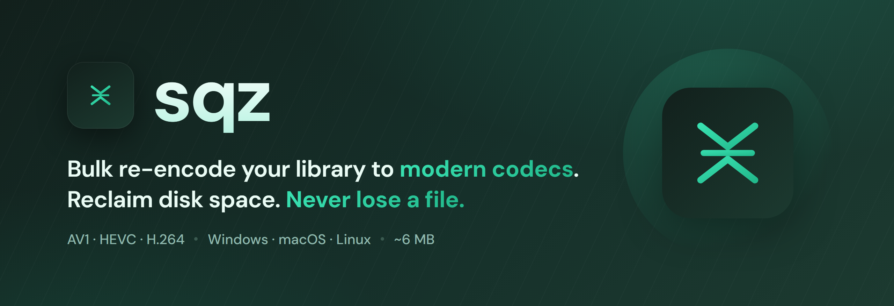
<br><br>

[](https://github.com/exxvius/sqz/actions/workflows/ci.yml)
[](https://github.com/exxvius/sqz/releases)
[](LICENSE)


</div>

sqz re-encodes your video library to a modern codec (AV1, HEVC, or H.264) and gives
you the disk space back. Point it at a few files or a whole folder, say how hard to
compress, and it grinds through them.

The thing it really cares about is not losing your originals. An original only gets
replaced once the new copy has proven it plays, runs the full length of the source,
and comes out smaller. If an encode can't clear that bar, sqz leaves the file alone
and moves on.

The download is about 6 MB and there's no command line to learn. FFmpeg isn't
bundled: sqz fetches it the first time you run it, or you can point it at a build you
already have.

<div align="center">
  <picture>
    <source media="(prefers-color-scheme: dark)" srcset="docs/images/dashboard-dark.png">
    <source media="(prefers-color-scheme: light)" srcset="docs/images/dashboard-light.png">
    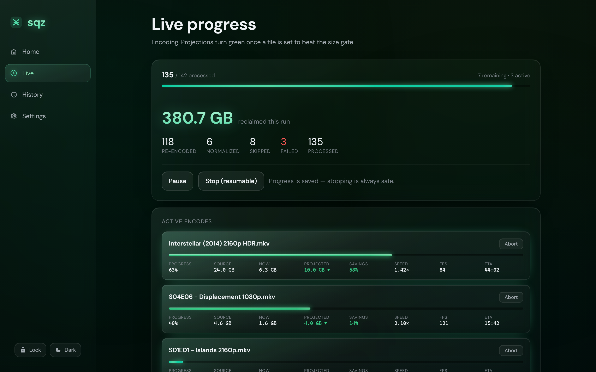
  </picture>
</div>

## How a replacement actually happens

A bad encode should never cost you a file, so the swap only happens at the very end,
after the new copy has earned it:

1. **Probe** the source with ffprobe. If it won't read, it's marked failed and skipped.
2. **Skip** files already in your target codec at or below the height cap. Nothing to gain there.
3. **Encode** into a scratch folder on the same drive. The original is never written to.
4. **Verify** the output. It has to parse, land within a second of the source duration, decode clean, and be at least 10% smaller (that number is yours to change). Miss any of those and the original is kept.
5. **Swap** with a same-volume rename, then send the original to the Recycle Bin, a holding folder, or delete it, whichever you picked.
6. **Record** the outcome in a SQLite manifest. That is what makes a run resumable, and what the History tab reads from.

# Features

<div align="center">

### Codec and quality presets
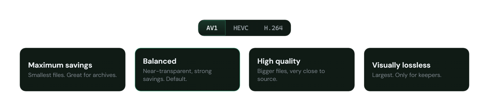
<br><br><br>

### Uses your GPU
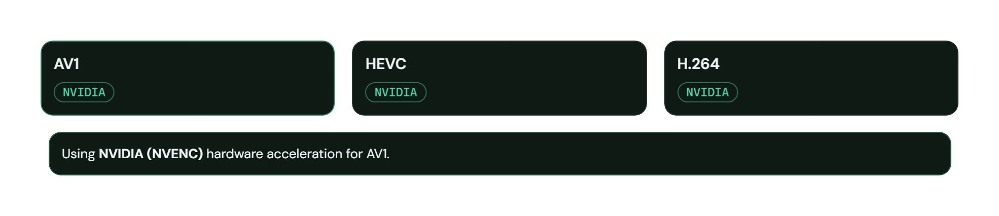
<br><br><br>

### See your savings before you run
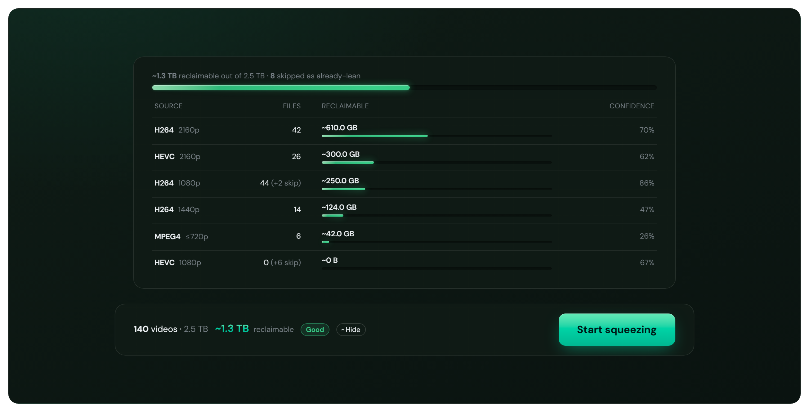
<br><br><br>

### Originals go where you tell them
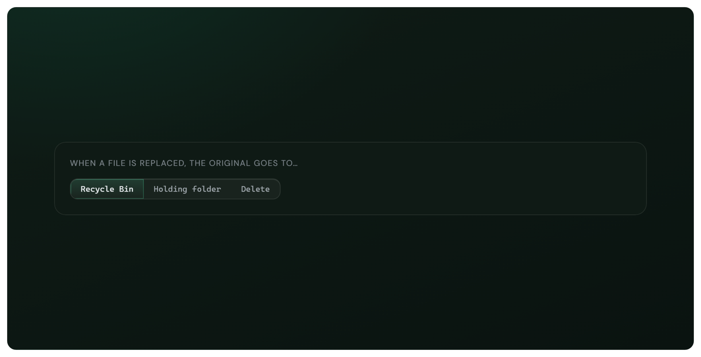
<br><br><br>

### Watch every encode live
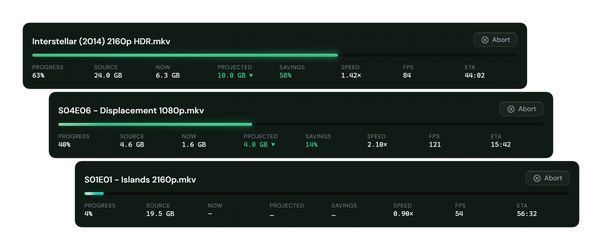
<br><br><br>

### Lock it and walk away
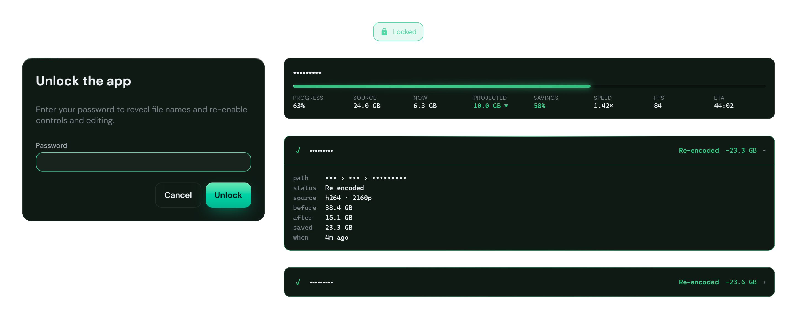
<br><br><br>

### Searchable history of every file
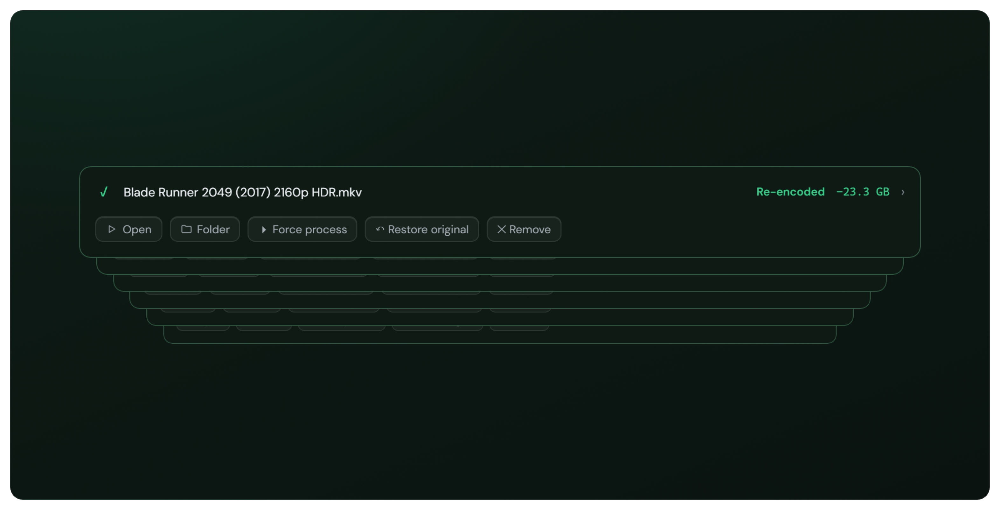
<br><br><br>

### Seventeen accent colors with light and dark themes
<br>
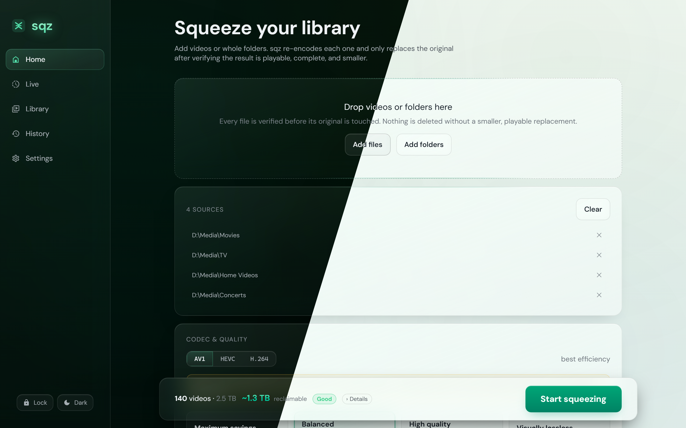
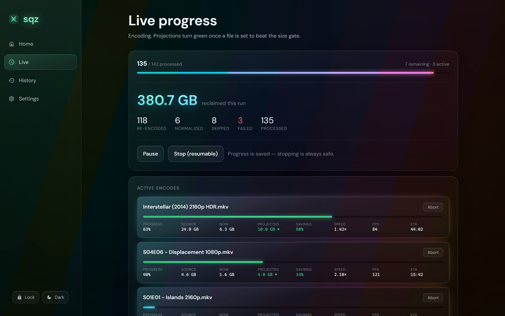
<br>
</div>

<br><br>

## Building from source

You'll need the [Tauri v2 prerequisites](https://v2.tauri.app/start/prerequisites/):
Rust, Node.js, and your platform's webview libraries.

```bash
npm install
npm run tauri icon src-tauri/icons/sqz.svg   # generate icons (first time only)
npm run tauri dev
npm run tauri build                          # portable, self-contained package
```

The engine (probe, encode, verify, swap, manifest) is Rust. The UI is React running
on Tauri v2. There's more in [docs/ARCHITECTURE.md](docs/ARCHITECTURE.md).

## License

sqz is MIT licensed; see [LICENSE](LICENSE). It doesn't bundle or link FFmpeg. The
GPL build it downloads sits next to the app in its data folder, and [NOTICE](NOTICE)
spells out what that means. FFmpeg is a trademark of Fabrice Bellard, and sqz isn't
affiliated with the FFmpeg project.
