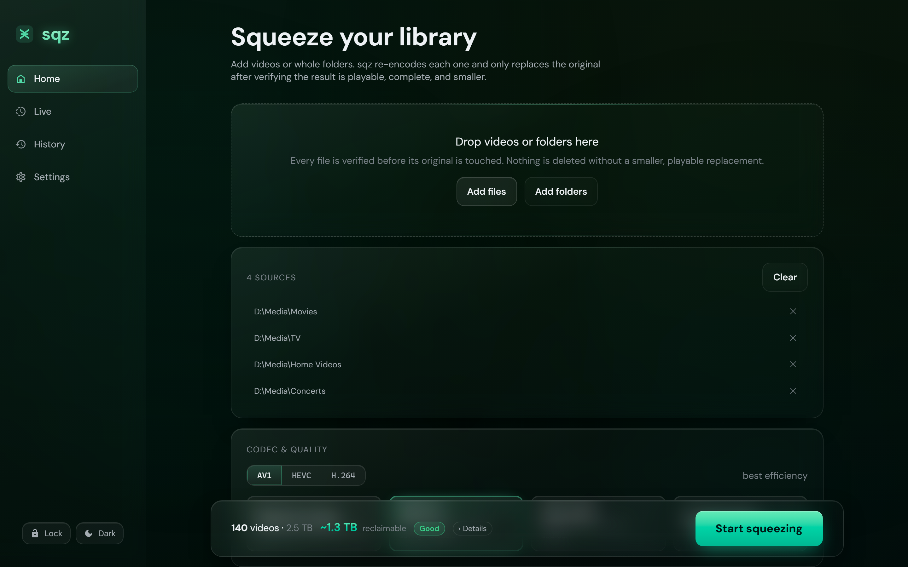
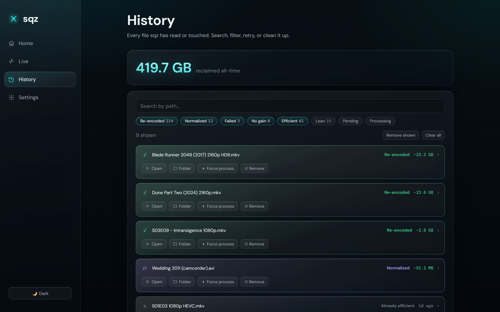

<div align="center">


<br><br>

[](https://github.com/exxvius/sqz/actions/workflows/ci.yml)
[](https://github.com/exxvius/sqz/releases)
[](LICENSE)


</div>

sqz bulk re-encodes your videos to AV1, HEVC, or H.264 and replaces each original
with the smaller copy — but only after verifying that copy plays, matches the
source duration, and is meaningfully smaller. If a check fails, the original is
left untouched.

~6 MB download, no command line. FFmpeg isn't bundled; sqz downloads it on first
run, or uses a copy you already have.

<div align="center">
  <picture>
    <source media="(prefers-color-scheme: dark)" srcset="docs/images/dashboard-dark.png">
    <source media="(prefers-color-scheme: light)" srcset="docs/images/dashboard-light.png">
    
  </picture>
</div>

## How a file gets replaced

Nothing destructive happens until the new file has earned it:

1. **Probe** with ffprobe. Unreadable files are logged as failed and skipped.
2. **Skip** files already in the target codec at or below the height cap.
3. **Encode** to a scratch folder on the same volume — the original is never
   written to.
4. **Verify**: the output must parse, match the source duration (±1 s), decode
   without errors, and be at least 10% smaller (configurable). Otherwise the
   original is kept.
5. **Swap** with a same-volume rename, then send the original to the Recycle Bin /
   Trash, a holding folder, or permanent deletion.
6. **Record** the outcome to a SQLite manifest — this is what makes runs
   resumable and populates the History tab.

## Screenshots

<p align="center">
  
  &nbsp;
  
</p>

## Hardware & quality

sqz uses your GPU encoder when it can — NVENC (NVIDIA), AMF (AMD), QSV (Intel),
VideoToolbox (Apple) — and falls back to software (SVT-AV1, x265, x264) otherwise.
Pick a target (*Maximum savings*, *Balanced*, *High quality*, *Visually lossless*)
and sqz maps it to encoder settings; every option is exposed under **Advanced**.

## Building from source

Requires the [Tauri v2 prerequisites](https://v2.tauri.app/start/prerequisites/)
(Rust, Node.js, platform webview libraries).

```bash
npm install
npm run tauri icon src-tauri/icons/sqz.svg   # generate icons (first time only)
npm run tauri dev
npm run tauri build                          # portable, self-contained package
```

The engine (probe, encode, verify, swap, manifest) is Rust; the UI is React on
Tauri v2. See [docs/ARCHITECTURE.md](docs/ARCHITECTURE.md).

## License

MIT ([LICENSE](LICENSE)). The FFmpeg build sqz downloads is GPL and lives beside
the app in its data folder — never bundled or linked into the binary. See
[NOTICE](NOTICE). FFmpeg is a trademark of Fabrice Bellard; sqz is not affiliated
with the FFmpeg project.
